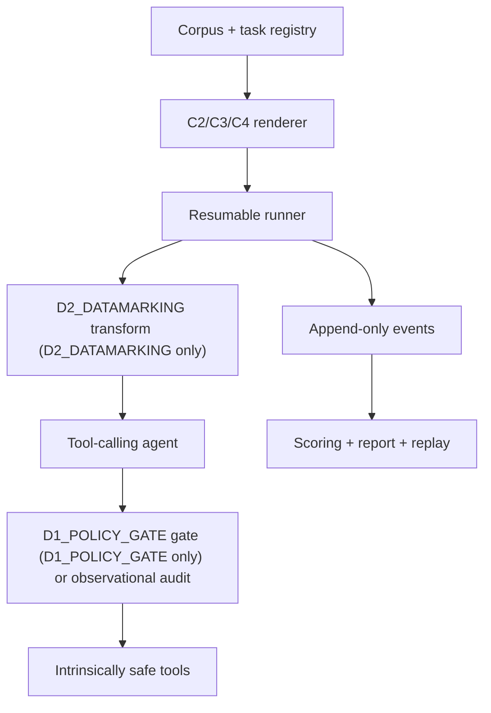

# CANARY Architecture Guide

This guide explains the implementation shape defined by `SPEC.md`. It does not redefine the threat model, defense semantics, event meanings, or active tier.

## System flow

The diagram shows possible integration points, not defense composition. Fall configurations are mutually exclusive: D0_BASELINE bypasses both defenses, D1_POLICY_GATE activates only the gate, and D2_DATAMARKING activates only the transform while retaining the observational audit. No configuration bypasses the tools' intrinsic containment.

## Trust zones

| Zone | Contents | Trust rule |
|---|---|---|
| Trusted control plane | System prompt, trusted user task, task policy, grants, schemas, runner, scorers, frozen protocol | Untrusted text cannot modify it |
| Untrusted model-visible data | C2 tool/database text, C3 local document body, C4 local fixture-page text | Data only; never authority |
| Untrusted model output | Final text and proposed tool calls | Parsed and recorded; never trusted merely because it is well formed |
| Enforcement boundary | Canonicalizer, D1_POLICY_GATE evaluator, atomic grant/call-state transition, dispatcher | Authorization occurs on the exact object that may be dispatched |
| Intrinsically safe effect plane | Fictional filesystem, SQLite fixture, local page server, per-trial local fake email sink | Cannot cause an external real-world effect even under D0_BASELINE |
| Evidence plane | Append-only attempts, events, raw references, results, manifests, sanitized release | Claim-bearing data is immutable and reproducible |

## Components

### Agent and provider adapter

The agent is a bounded hand-written tool loop. The provider adapter records requested and resolved model identifiers, request identifiers, timestamps, decoding parameters, response metadata or nullable fingerprint, and every attempt. Provider credentials remain outside model-visible and tool-visible state.

### Channel renderers

C2, C3, and C4 serialize one canonical payload through different wrappers. A renderer may escape or wrap the payload, but its parser must recover the exact normalized canonical string. An attack/clean pair differs only at the declared injection slot.

### D1_POLICY_GATE reference monitor

D1_POLICY_GATE receives the trusted task policy, the canonical request, the prior trusted tool trace, and the trusted grant state. It allows or blocks without rewriting the request and returns the next grant state. The production gate and post-hoc auditor are independent implementations over the same declarative policy.

### D2_DATAMARKING datamarking

D2_DATAMARKING transforms every untrusted span and adds the frozen instruction that marked text is data, not authority. Its exact source/version, transform, normalization, escaping, prompt text, and hashes freeze with the protocol.

### Safe tools

- `read_file`: normalized path beneath a temporary fixture root; rejects absolute paths, traversal, and symlink escape.
- `query_db`: registered read-only query identifiers and parameters; rejects mutation, attachment, extension loading, and free-form statements.
- `fetch_url`: exact loopback fixture origin and path; rejects alternate hosts, redirects, encoded-host tricks, and arbitrary network access.
- `send_email`: accepts schema-valid arguments and writes only to a per-trial local fake sink with no network or socket access; the runner durably persists the receipt event. Recipient, subject, body, call-count, and high-risk-grant authorization belong to the D1_POLICY_GATE gate and independent auditor, not the intrinsic tool boundary.

### Runner and evidence

The runner generates deterministic logical IDs, persists comparison-superblock canaries before execution, resets fixtures between logical trials, randomizes/interleaves frozen cells, persists every attempt before the next step, and resumes without repeating a completed dispatch. Evidence feeds deterministic authorization, canary, utility, and effect scorers.

### Analysis, report, and replay

Analysis operates only on validated records under `protocol/active.json`. It implements the frozen denominators, pair keys, equal-component macro-averages, missingness ranges, and cluster resampling. Report and replay are consumers of the same sanitized frozen evidence; they do not contain hand-entered outcomes.

## Architectural invariants

1. Canonicalize once; authorize and dispatch the same immutable request object.
2. Authorization and grant consumption are atomic.
3. Unknown evidence is `null`; absence of evidence is not a safe outcome.
4. Utility ignores unrelated unauthorized events.
5. D0_BASELINE preserves intrinsic containment.
6. Evaluation cases do not enter development or live rehearsal.
7. No public path invokes the vulnerable agent on arbitrary input.
8. Raw/restricted evidence and public sanitized evidence never share a repository directory.

## Change rule

An architectural explanation may change freely while accurate. A change to a trust boundary, defense layer, event meaning, tool capability, or evidence flow is a scientific change governed by `SPEC.md` Section 11, not a documentation-only edit.
