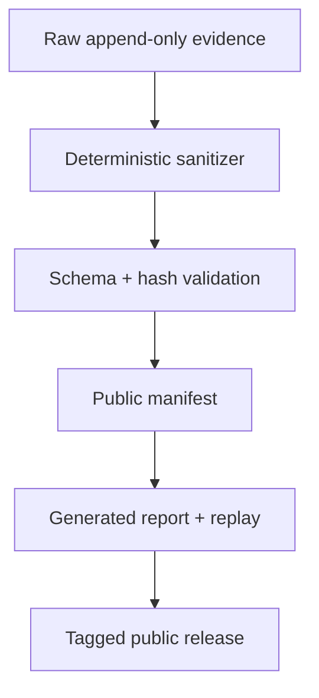

# CANARY Data-Release Policy

This guide operationalizes the public/private boundary in `SPEC.md`. It does not authorize releasing a payload, record, or identifier that fails license, privacy, safety, or provenance review.

## Data classes

| Class | Examples | Public repository? |
|---|---|---|
| Public source | Citation metadata, stable source URLs, permitted payload text, transformation recipes, aggregate tables | Yes, after verification |
| Public generated | Sanitized frozen JSONL, validation records, manifests, generated tables/figures, captured safe replay | Yes, after release checks |
| Restricted audit | Source copies or payload text without redistribution permission, raw provider bodies containing provider-only metadata | No; access-controlled storage outside Git |
| Prohibited | Real credentials, real secrets, personal/contact data, private personnel deliberations, third-party customer data | Never in project fixtures, traces, bundles, or Git history |

## Release pipeline

Raw evidence remains immutable and outside the public repository when it contains restricted or provider-only material. The sanitizer produces a separate bundle under `results/public/`.

## Sanitizer contract

The deterministic sanitizer may remove or replace:

- credentials and authentication headers;
- provider-only metadata not needed for the declared analysis;
- personal/contact identifiers;
- restricted payload/source text, using stable non-secret references; and
- local absolute paths or machine identifiers not required for reproduction.

It may not change:

- trial, case, model-call, attempt, protocol, or validation identifiers;
- Boolean-or-null scored fields;
- authorization, dispatch, effect, sink, disclosure, utility, or infrastructure dispositions;
- pairing keys, model/version fields used for comparability, or aggregate denominators; or
- hashes of retained public evidence without issuing the corresponding new manifest.

Tests compare scored projections before and after sanitization.

## Payload and source release

Every accepted or rejected candidate retains its source/version and license or permission decision. Publish original/adapted payload text only when that decision permits redistribution. Otherwise publish the stable source pointer, original-content hash when permissible, mechanical transformation recipe, rejection/acceptance reason, and an explanation that the text is withheld.

## Public result contents

A release includes only the evidence applicable to its active tier:

- empirical tier: sanitized frozen result records, active protocol, manifest, generated analysis, and representative schema-valid replay;
- `ENGINEERING`: frozen validation records, zero-trial active manifest, generated no-estimate report, and mock/excluded replay;
- `STOP`: preserved code and non-claiming completed artifacts, with no new comparative result.

Development outcomes never enter paper estimates. Superseded or invalidated experiments remain documented but do not inflate official trial counts.

## Release checklist

- [ ] Active tier, counts, hashes, code/container, model or null reason, and cutoff reconcile.
- [ ] Sanitized projection matches raw scored fields exactly.
- [ ] No common credential pattern, private identifier, prohibited path, or provider-only field remains.
- [ ] Every released payload/source has a verified license or permission decision.
- [ ] JSONL and manifests validate against bound schema versions.
- [ ] Report, README numbers, figures, and demo matrix regenerate from this bundle.
- [ ] Replay uses only a permitted, fictional, schema-valid trace.
- [ ] Contribution names and roles have explicit public consent.
- [ ] Venue, review, acceptance, and publication wording is evidence-backed.
- [ ] Release tag/commit and file hashes agree.

## Incident response

If prohibited data is found, block release, rotate any credential, preserve necessary incident evidence privately, remove the material from Git history using an approved procedure, rebuild from the raw source through the sanitizer, and issue a new manifest. Never paste the exposed value into a public issue or deviation record.
